<h1 align="center">
    <br>
    <p align="center">Rede de Apoio: Aldeia Virtual<p>
</h1.>

<p align="center">
</p>
<br>


<p align="justify"> Bem vindx, ao meu projeto! Sinta-se a vontade para explorar, ele foi desenvolvido como requisito final para a conclusão do curso "Todas em Tech" da {reprograma}. 


# 📚JUSTIFICATIVA:

<p align="justify">
Minha experiência com a maternidade, principalmente a maternidade solo, me fez perceber o quão as mães estão - na maioria das vezes - sozinhas num período tão sensível. A maternidade acaba por ser um período de solidão por não ser tão discutida em sua totalidade, o que pode ser observado é uma romantização de um momento marcado por mudanças drásticas nos quesitos hormonal, corporal, psicológico.

<p align="justify">
Em alguns casos, a maternidade vem acompanhada de depressão pós parto; confusão por não se reconhecer mais diante daquele corpo; estranhamento numa rotina que por muitas vezes não foi planejada ou desejada. Ter acesso a uma rede de profissionais que possam ser essa rede de apoio é algo que também divide as mães negras, interioranas e periféricas.


## 🔎 SOBRE A API:

<p align="justify">
O projeto "Rede de Apoio: Aldeia Virtual" é voltado para mulheres que fazem parte da população em vulnerabilidade financeira que necessitam ter acesso a profissionais que auxiliem em questões psicológicas, psiquiátricas e legais que permeiam a maternidade. Sendo assim ela é dividida em duas partes:

 - **Profissionais**: um espaço de consulta e cadastro de profissionais que trabalham cobrando valor social ou pro bono.
 - **Textos randômicos**: mensagens afirmativas que reforçam que a maternidade não é perfeita, não é romântica, mas é única e está tudo bem.

## ⚙️ FUNCIONALIDADES:

- Listar todos os Profissionais da API;
- Listar Profissionais por meio de filtros;
- Cadastro, atualização e exclusão de profissionais;
- Criação, atualização e exclusão de textos;
- Listar todos os Textos da API;
- Gerar um texto randômico.


## 💻 MÉTODOS:
<p align="justify">
Desenvolvida utilizando JavaScript e Node.js, a API conta com dois CRUDs completos que respeitam princípios de SOLID e Clean Code. Utilizando a conexão com bando de dados MongoDB e as rotas foram testadas no Postman.

## 📂 ARQUITETURA MVC
```
 📁PROJETO FINAL
   |
   |-  📁 assets
   |-  📁 src
   |    |
   |    |- 📁 controllers
   |         |- 📑 professionalController.js
   |         |- 📑 textController.js
   |
   |    |- 📁 database
   |         |- 📑 mongoConfig.js
   |
   |    |- 📁 models
   |         |- 📑professionalSchema.js
   |         |- 📑textSchema.js
   |
   |    |- 📁 routes
   |         |- 📑indexRoutes.js 
   |         |- 📑professionalRoutes.js 
   |         |- 📑textRoutes.js
   |
   |    |- 📑 app.js
   |    |- 📑 swagger.json
   |
   |
   |- 📑 .env
   |- 📑 .env.example
   |- 📑 .gitignore
   |- 📑 package-lock.json
   |- 📑 package.json
   |- 📑 Procfile
   |- 📑 README.me
   |- 📑 server.js
     
```

## 👨‍💻 TECNOLOGIAS E PACOTES UTILIZADOS:


**TECNOLOGIAS**

- [Git/GitHub](https://github.com/)
- [Heroku](https://dashboard.heroku.com/apps)
- [JavaScript](https://www.javascript.com/)
- [MongoDB Atlas](https://www.mongodb.com/cloud/atlas)
- [Node.js](https://nodejs.org/en/)
- [Postman](https://www.postman.com/)
- [VScode](https://code.visualstudio.com/)  

### PACOTES


- [Cors](https://www.npmjs.com/package/cors)
- [Dotenv-safe](https://www.npmjs.com/package/dotenv)
- [Express](https://expressjs.com/pt-br/)
- [Mongoose](https://mongoosejs.com/)
- [Nodemon](https://www.npmjs.com/package/nodemon)
- [Swagger](https://www.npmjs.com/package/swagger-ui-express)


# 🔃 ROTAS


## 🔃 ROTA INDEX E SWAGGER

| Método HTTP  | Endpoint                     | Descrição                            |
| ------------ | ---------------------------- | ------------------------------------ |
| GET          | `http://localhost:PORT/`     |  Apresentação do projeto    |             |


## 🔃 ROTAS - PROFISSIONAL

| Método HTTP  | Endpoint              | Descrição                                  |
| ------------ | --------------------- | ------------------------------------------ |
| GET          | `/professionals/search`         | Lista todos os profissionais cadastrados             |
| GET          | `/professionals/search-occupation`     | Filtra os profissionais pela ocupação   |
| GET          | `/professionals/search-gender`     | Filtra os profissionais pelo gênero   |
| GET          | `/professionals/search-probono`     | Filtra os profissionais que fazem pro bono  |
| GET          | `/professionals/search/:id`     | Filtra os profissionais pelo ID   |
| POST        | `/professionals/register`         | Cadastro dos profissionais               |
| PUT          | `/professionals/update/:Id`         | Atualizar o cadastro de algum profissional            |
| DELETE          | `professionals/delete/:id`     | Deletar um cadastro por ID  |


    
## 🔃 ROTAS - TEXTOS

| Método HTTP  | Endpoint              | Descrição                                  |
| ------------ | --------------------- | ------------------------------------------ |
| GET          | `/texts/all`         | Listar todos textos cadastrados            |
| GET          | `/texts/random`         | Mostrar uma mensagem aleatória previamente cadastrada            |
| GET          | `/texts/:id`         | Filtra o texto por ID            |
| POST          | `/texts/new`     | Cadastra um novo texto   |
| PUT          | `/texts/update/:id`     | Atualiza uma texto |
| DELETE       | `/texts/delete/:id`         | Deleta um texto por ID            


## 🛑​ PARA REALIZAR A INSTALAÇÃO NO SEU COMPUTADOR:


1. Primeiro é necessário clonar o seguinte repositório:

    ```bash
    $ git clone https://github.com/anaelisaq/rede-apoio.git
     ```

2. Entre na seguinte pasta: 

    ```bash
    $ cd PROJETO-REDE-APOIO/
    ```
    
3. Para prosseguir, é necessário baixas as dependências: 

   ```bash
    $ npm install
    ```
4. Inicie o projeto com o comando: 

   ```bash
    $ npm run dev
    ```   

<br>

---


# ✔️VISUALIZAÇÃO E FUNCIONAMENTO:


<br>

>Cadastrando um profissional
<div align = "center">
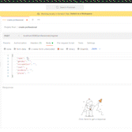

</div>
<br>


<br>

>Listando todos os profissionais cadastrados
<div align = "center">
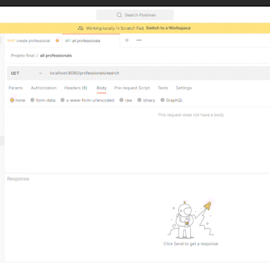

</div>
<br>
<br>

>Filtrando pela ocupação:
<div align = "center">
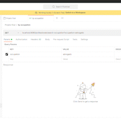

</div>
<br>
<br>

>Filtrando pelo gênero:
<div align = "center">
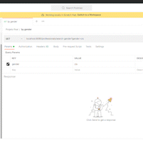

</div>
<br>
<br>

>Filtrando por pro bono:
<div align = "center">
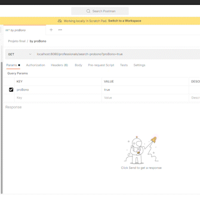

</div>
<br>
<br>

>Encontrando por ID:
<div align = "center">
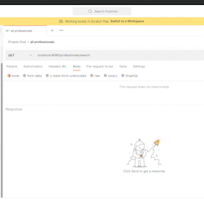

</div>
<br>
<br>

>Atualizando o cadastro de um profissional:
<div align = "center">
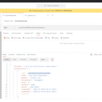

</div>
<br>
<br>

>Deletando o cadastro de um profissional:
<div align = "center">
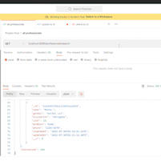

</div>
<br>
<br>

>Cadastrando texto:
<div align = "center">
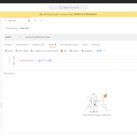

</div>
<br>
<br>

>Listando todos os textos cadastrados:
<div align = "center">
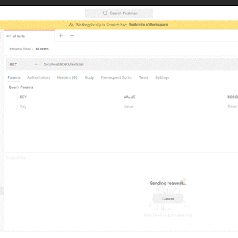

</div>
<br>
<br>

>Selecionando um texto aleatório do banco de dados:
<div align = "center">
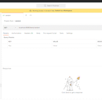

</div>
<br>

>Selecionando por ID:
<div align = "center">
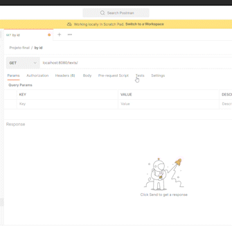

</div>
<br>
<br>

>Atualizando texto:
<div align = "center">
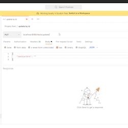

</div>
<br>
<br>

>Deletando um texto por ID:
<div align = "center">
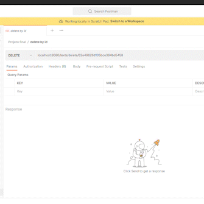

</div>
<br>

## 🏗️ IMPLEMENTAÇÕES FUTURAS:

* ⬛ Desenvolver um front-end;
* ⬛ Adaptar a API para um formato de APP;
* ⬛ Implementar mensagens introdutórias nos endpoints primários `/professionals` e `/texts`;
* ⬛ Implementar cadastramento, autenticação de usuários;
* ⬛ Implementar espaço para compartilhamento de experiências entre as mães;
* ⬛ Implementar espaço para troca de itens usados;
* ⬛ Implementar testes unitários.

##  👩 SOBRE A AUTORA:


|Autora|Vivência|
|:------:|----|
|  | Me chamo Ana Elisa Alexandre, recifense, mulher negra, mãe solo, historiadora e desenvolvedora Back-end. Minha vivência com a maternidade solo e a pandemia, fez com que eu desenvolvesse uma deperessão pós parto e somente com a ajuda de profissionais eu consegui sair dessa para que fosse possível correr atrás dos direitos da minha filha. A {reprograma} foi essencial nessa jornada por me mostrar que as barreiras entre as mulheres e a tecnologia são criadas e sustentadas pelo patriarcado, porém juntas podemos diminuí-las e possibilitar as mulheres de diversos contextos mudar sua própria história. |

##  ✨ CONTATO:

<div>
<a href="https://instagram.com/anaelisaq" target="_blank"></a>
<a href = "mailto:anaelisa.abs@gmail.com"></a>
<a href="https://www.linkedin.com/in/ana-elisa-alexandre" target="_blank"></a>   
</div>